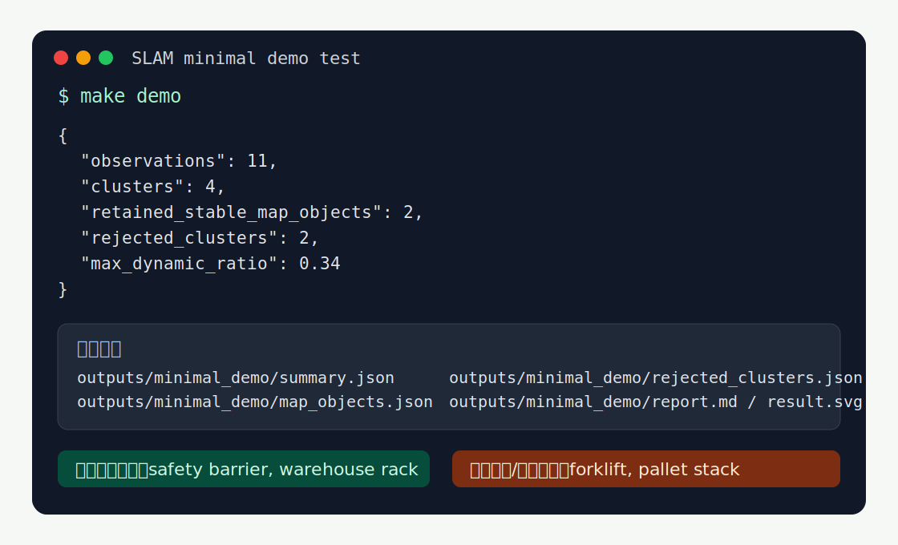
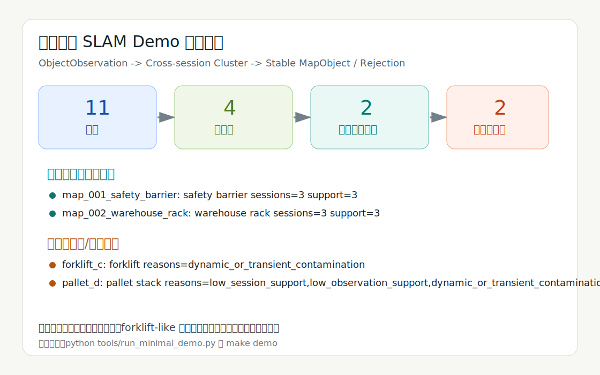
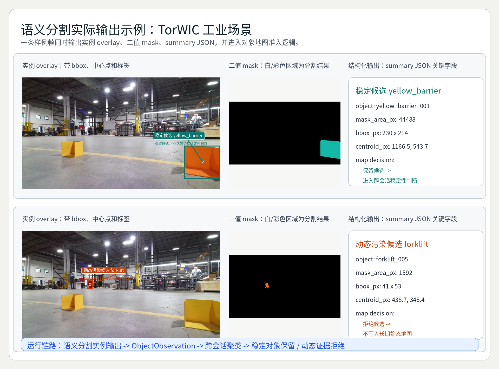
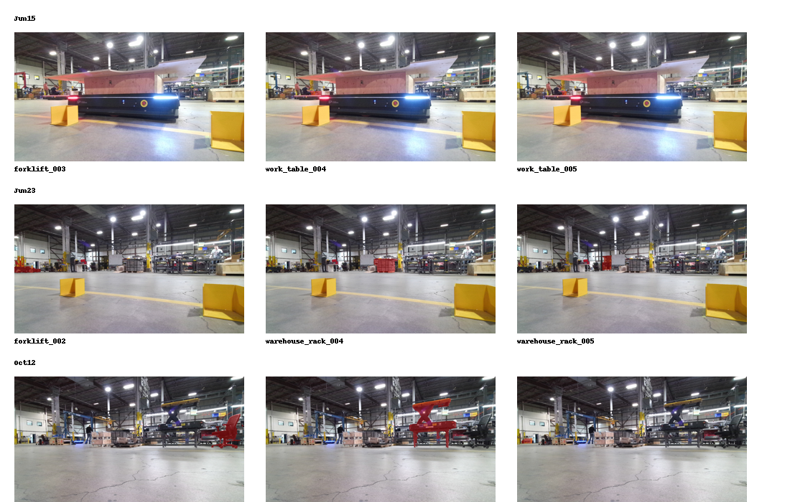
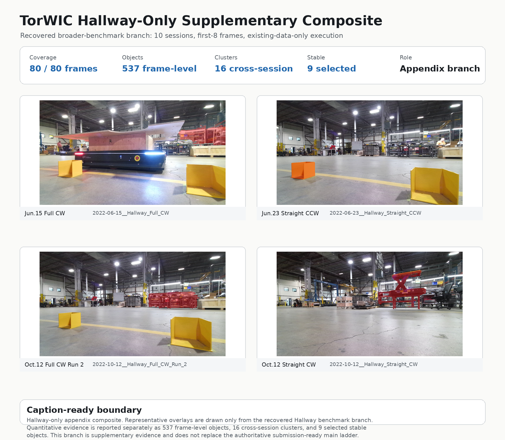
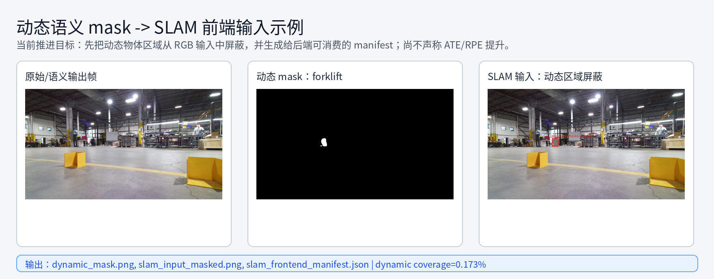

# 动态工业环境语义分割辅助 SLAM

本仓库用于推进一篇关于 **动态工业环境中语义分割辅助 SLAM** 的论文和最小可运行系统。

核心思想很简单：开放词汇语义分割产生的对象不能直接写入长期 SLAM 地图。它们应先成为可审计的对象观测，再经过跨会话稳定性、持久性和动态性过滤，最后才决定是进入稳定语义地图，还是作为动态/瞬时证据被拒绝。

当前工程状态需要明确区分：

- 已打通：语义分割实例输出 -> `ObjectObservation` -> 跨会话对象聚类 -> 稳定对象保留 / 动态污染拒绝；
- 已有可视化：工业场景 overlay、mask、bbox、中心点、summary JSON 和地图准入决策；
- 新增后端 input pack：raw RGB / masked RGB / TUM-style GT 片段 -> `backend_input_manifest.json`；
- 新增后端 smoke：DROID-SLAM raw vs masked 12 配置变体，全在单 session（Jun 15 Aisle_CW_Run_1）64 帧窗口上；仅有 P132（8 帧 smoke）有 evo ATE/RPE（Δ=0.001mm，effectively tied）；剩余 11 个 64 帧配置仅有估计轨迹，未经 evo 评估；
- P168 全数据集清点：20 sessions, 32,743 RGB frames, 18/20 有语义前端，1/20 有 DROID-SLAM 后端；
- 尚未完成：扩大到多 session DROID-SLAM 后端轨迹实验，并报告有统计意义的 ATE/RPE、建图质量或导航收益；
- 因此本文当前主张是“语义分割辅助的动态对象过滤与长期对象地图维护”，不是“完整动态 SLAM benchmark 已经闭环优于现有后端”。

## 0. 环境与安装

环境的作用只是隔离依赖和固定运行口径，不是项目能力本身。

本仓库保留两个入口层级：

- **最小 demo 入口**：只使用 Python 标准库，不需要 GPU、CUDA、PyTorch、模型权重或 TorWIC 原始数据；任意 Python 3.10+ 环境都能运行。
- **完整研究/GPU 入口**：用于语义分割、DROID-SLAM、PyTorch CUDA、cuDNN、evo 和 raw-vs-masked 后端实验，需要 GPU 环境、SLAM 后端、模型权重和数据路径。

### 0.1 最小测试环境

适合外部读者快速验证仓库核心对象地图准入闭环。

```bash
git clone git@github.com:ruirui688/SLAM.git
cd SLAM
python --version

# 可选：隔离最小 demo 环境
python -m venv .venv
source .venv/bin/activate

python tools/run_minimal_demo.py
# 或
make demo
```

最低要求：

- Python 3.10 或更高版本；
- Linux/macOS/Windows 均可；
- 不需要 `pip install`；
- 不需要 CUDA、PyTorch、模型权重、TorWIC 原始数据或网络。

### 0.2 完整研究/GPU 环境

适合复现语义分割、动态 mask、DROID-SLAM 后端和 ATE/RPE 评估。推荐使用
conda/mamba 管理，避免系统 Python、`.venv` 和研究依赖混用。

通用安装轮廓：

```bash
# 1. 创建研究环境
conda create -n slam-research python=3.10 -y
conda activate slam-research

# 2. 安装 CUDA 版 PyTorch；版本需按本机驱动/CUDA 调整
pip install torch torchvision torchaudio --index-url https://download.pytorch.org/whl/cu118

# 3. 安装评估和常用工具
pip install evo opencv-python pillow numpy scipy matplotlib tqdm pyyaml

# 4. 安装或接入 DROID-SLAM
git clone https://github.com/princeton-vl/DROID-SLAM.git thirdparty/DROID-SLAM
pip install -e thirdparty/DROID-SLAM

# 5. 可选：安装语义前端依赖
# Grounding DINO / SAM2 / OpenCLIP 的权重和版本按实验需要单独固定。
```

完整研究环境还需要：

- NVIDIA GPU 和可用驱动；
- CUDA/cuDNN 与 PyTorch wheel 匹配；
- DROID-SLAM 权重，例如 `droid.pth`；
- TorWIC 或等价 RGB/GT 数据；
- 如需自动语义分割，另需 Grounding DINO、SAM2、OpenCLIP 及对应权重。

网络较慢时可以设置代理或使用镜像，但 PyTorch CUDA wheel、DROID-SLAM、模型权重和数据集应固定版本并记录来源，避免论文结果不可复现。

### 0.3 本机已验证环境

在这台机器上，持续推进研究时统一使用现有 conda 环境 `tram`：

```bash
LD_LIBRARY_PATH=/home/rui/miniconda3/envs/tram/lib:$LD_LIBRARY_PATH conda run -n tram <command>
```

后端环境复查入口：

```bash
make dynamic-slam-backend-env-check
```

已验证：`tram` 环境中 PyTorch `2.4.0+cu118`、CUDA、cuDNN、`droid_backends`、`lietorch`、`evo`、DROID-SLAM 权重和后端输入包均可用。沙箱化探测可能看不到 `/dev/nvidia*`，不应据此判断整机 GPU 不可用。

## 1. 最小可运行 Demo

这是给外部读者的第一入口。它不需要下载 TorWIC，不加载 Grounding DINO/SAM2/OpenCLIP，不需要 GPU，不访问网络，只使用 Python 标准库和仓库内置的小样例数据。

测试环境和完整研究环境的安装方法见 §0。这个最小 demo 没有第三方依赖，所以不需要 `pip install`。

### 运行入口

方式一：

```bash
python tools/run_minimal_demo.py
```

方式二：

```bash
make demo
```

它运行的最小闭环是：

```text
ObjectObservation -> cross-session cluster -> retained MapObject or rejection
```

输入样例：

```text
examples/minimal_slam_demo/observations.json
```

输出目录：

```text
outputs/minimal_demo/
```

### 已验证的测试结果

我在本仓库当前环境中运行：

```bash
make demo
```

得到输出：

```json
{
  "input": "/home/rui/slam/examples/minimal_slam_demo/observations.json",
  "output_dir": "/home/rui/slam/outputs/minimal_demo",
  "observations": 11,
  "clusters": 4,
  "retained_stable_map_objects": 2,
  "rejected_clusters": 2,
  "criteria": {
    "min_sessions": 2,
    "min_observations": 3,
    "max_dynamic_ratio": 0.34,
    "min_label_purity": 0.6
  }
}
```

生成文件：

```text
outputs/minimal_demo/summary.json
outputs/minimal_demo/map_objects.json
outputs/minimal_demo/rejected_clusters.json
outputs/minimal_demo/report.md
outputs/minimal_demo/result.svg
```

结果图如下：





### 语义分割输出示例

上面的最小 demo 证明仓库可以无依赖跑通地图准入闭环。下面这张图展示更接近论文 pipeline 的实际语义分割输出：同一 TorWIC 工业场景中的实例 overlay、二值 mask、summary JSON，以及进入对象地图前的“保留候选 / 动态拒绝”判断。图中的 bbox 和中心点来自实例 summary JSON，不是后期随意贴上去的装饰。



可以重新生成这张标注图：

```bash
make semantic-example
```

验证输出：

```text
examples/semantic_segmentation_example/semantic-segmentation-result.png
examples/semantic_segmentation_example/yellow-barrier-annotated.png
examples/semantic_segmentation_example/forklift-annotated.png
```

示例文件：

```text
examples/semantic_segmentation_example/semantic-segmentation-result.png
examples/semantic_segmentation_example/yellow-barrier-annotated.png
examples/semantic_segmentation_example/yellow-barrier-overlay.png
examples/semantic_segmentation_example/yellow-barrier-mask.png
examples/semantic_segmentation_example/yellow-barrier-summary.json
examples/semantic_segmentation_example/forklift-annotated.png
examples/semantic_segmentation_example/forklift-overlay.png
examples/semantic_segmentation_example/forklift-mask.png
examples/semantic_segmentation_example/forklift-summary.json
```

解释：

- `yellow_barrier` 是稳定基础设施候选，后续可进入跨会话稳定对象准入判断；
- `forklift` 是动态污染候选，后续地图维护中应被拒绝为动态证据；
- 这组图是实际语义分割输出样例，不是抽象流程图；
- 它展示的是“语义分割实例输出 -> ObjectObservation -> 跨会话聚类 -> 稳定对象保留 / 动态证据拒绝”的论文链路。

### 真实工业场景示例

上面的 SVG 是运行 `make demo` 后的结构化结果图，展示仓库可以实际跑出“保留稳定对象 / 拒绝动态证据”的结果。下面两张图只用于说明项目面向的真实工业场景，不在图上强行标注对象位置，避免误导读者。

**图 1：TorWIC 工业 RGB-D 重访中的分割 overlay。**

这张图展示 TorWIC 工业 RGB-D 重访中的真实场景和 segmentation overlay。它说明项目处理的不是玩具场景，而是真实工业环境中的语义观测。



**图 2：Hallway 更广泛验证分支结果。**

这张图展示 Hallway 10-session broader-validation 分支。它用于展示项目在另一个工业回访场景中的验证材料，不替代最小 demo 的运行结果。



结果解释：

- `safety barrier` 和 `warehouse rack` 跨 3 个 session 重复出现，被保留为稳定地图对象；
- `forklift` 虽然跨 session 出现，但动态比例为 1.0，被拒绝为动态污染；
- `pallet stack` 只在单 session 出现，且是瞬时对象，被拒绝；
- 这正对应论文主张：语义分割输出是候选证据，不是可直接写入持久地图的真值。

### 动态 SLAM 前端输入示例

这一步把动态语义 mask 继续往 SLAM 方向推进：将 `forklift` 动态区域从 RGB 输入中屏蔽，生成给 DROID-SLAM / ORB-SLAM 这类视觉前端可消费的 masked RGB 和 manifest。

运行：

```bash
make dynamic-slam-frontend
```

已验证输出：

```text
examples/dynamic_slam_frontend_example/dynamic_mask.png
examples/dynamic_slam_frontend_example/slam_input_masked.png
examples/dynamic_slam_frontend_example/slam_frontend_manifest.json
examples/dynamic_slam_frontend_example/dynamic_slam_frontend_result.png
```



这还不是完整 ATE/RPE 实验，但已经把“语义分割动态物体”转换成了 SLAM 前端可消费的输入形式。

### 动态 SLAM 后端输入包

继续往后端评估推进一步，可以生成一个 bounded raw-vs-masked 输入包：连续
TorWIC 左目 RGB 小窗口、对应 TUM-style ground truth 片段、raw/masked 两套
`rgb.txt` 和 manifest。

运行：

```bash
make dynamic-slam-backend-pack
```

已验证输出写入 ignored `outputs/`：

```text
outputs/dynamic_slam_backend_input_pack/raw/rgb.txt
outputs/dynamic_slam_backend_input_pack/masked/rgb.txt
outputs/dynamic_slam_backend_input_pack/groundtruth.txt
outputs/dynamic_slam_backend_input_pack/backend_input_manifest.json
```

### 动态 SLAM 后端 smoke 与最小 ATE/RPE

在本机 `tram` conda 环境中，已经完成一个 bounded DROID-SLAM smoke run：

```bash
make dynamic-slam-backend-smoke
```

已验证输出写入 ignored `outputs/`：

```text
outputs/dynamic_slam_backend_smoke_p132/raw_estimate_tum.txt
outputs/dynamic_slam_backend_smoke_p132/masked_estimate_tum.txt
outputs/dynamic_slam_backend_smoke_p132/dynamic_slam_backend_smoke_manifest.json
outputs/dynamic_slam_backend_smoke_p132/p132_p133_raw_vs_masked_metrics.md
```

8 帧 smoke 结果：

| 输入 | APE RMSE (m) | RPE RMSE (m) |
|---|---:|---:|
| raw RGB | 0.001242 | 0.002250 |
| masked RGB | 0.001243 | 0.002255 |

当前边界：这证明 raw-vs-masked 后端运行和 evo ATE/RPE 路径已经打通；但短窗口 raw/masked 基本持平，不能声称 masked input 已改善完整轨迹、建图质量或导航收益。

P134 进一步扩大到 64 帧，并启用 DROID-SLAM global BA：

```bash
make dynamic-slam-backend-64
```

64 帧 global BA 结果：

| 输入 | APE RMSE (m) | RPE RMSE (m) |
|---|---:|---:|
| raw RGB | 0.051135 | 0.032713 |
| masked RGB | 0.051136 | 0.032713 |


当前解释：64 帧后端链路已经可执行，raw/masked 仍基本持平；由于当前动态 mask 只作用于第 `000002` 帧，不能据此主张 masked input 带来轨迹收益。

P135 继续推进到已有语义 frontend masks：从
`outputs/torwic_cross_day_aisle_bundle_v1__2022-06-23__Aisle_CW_Run_1/frontend_output`
读取真实 forklift mask summary，按 `rgb_path` 合并到 64 帧后端输入包。

```bash
make dynamic-slam-backend-semantic-masks
make dynamic-mask-coverage-figure
```

结果诊断：

| 输入 | APE RMSE (m) | RPE RMSE (m) |
|---|---:|---:|
| raw RGB | 0.051135 | 0.032713 |
| semantic masked RGB | 0.051135 | 0.032713 |


当前解释：已有真实语义 mask 已接入后端，但只覆盖 64 帧中的 `000004`、`000005`、`000007`，64 帧平均覆盖率约 `0.026%`。这个结果不是失败，而是定位出下一步研究瓶颈：需要跨更多帧生成/传播动态 mask，才有可能观察到动态 masking 对轨迹的影响。

P136 做一个诚实的时序传播压力测试：把已有真实 forklift masks 按最近帧传播到
`±8` 帧，并做 `4 px` 膨胀。它不是新的 detector 输出，而是用来回答一个研究问题：
“如果覆盖率提高，后端指标是否开始对动态 masking 敏感？”

```bash
make dynamic-slam-backend-temporal-mask-stress
make dynamic-temporal-mask-stress-figure
```

结果：

| 输入 | APE RMSE (m) | RPE RMSE (m) |
|---|---:|---:|
| raw RGB | 0.051135 | 0.032713 |
| temporal propagated masked RGB | 0.051222 | 0.032710 |


当前解释：mask 覆盖从 P135 的 `3/64` 帧、均值 `0.025750%` 提高到 `16/64` 帧、均值 `0.267154%`，但 APE/RPE 仍基本持平。这说明简单最近帧传播还不足以形成可靠轨迹收益；下一步应做真正的逐帧动态 mask 生成或基于光流/视频分割的时序跟踪，而不是继续只扩大 SLAM 后端窗口。

P137 进一步把传播策略从“最近帧复制”换成稠密光流 warp：

```bash
make dynamic-slam-backend-flow-mask-stress
make dynamic-flow-mask-stress-figure
```

结果：

| 输入 | APE RMSE (m) | RPE RMSE (m) |
|---|---:|---:|
| raw RGB | 0.051135 | 0.032713 |
| flow propagated masked RGB | 0.051222 | 0.032710 |


当前解释：低成本稠密光流传播没有优于最近帧传播，说明瓶颈不只是“mask 不够多”，也包括 mask 质量、动态目标真实时序一致性和当前 DROID-SLAM 对小面积遮罩的敏感性。下一步应优先跑逐帧 Grounding DINO/SAM2 或 SAM2 video predictor，生成更接近真实动态目标的连续 masks。

P138 使用磁盘上已有的真实逐帧 frontend 结果，而不是传播结果：合并
`000000` 到 `000007` 八帧的 forklift masks，生成 64 帧后端输入。

```bash
make dynamic-slam-backend-first8-real-masks
make dynamic-first8-real-mask-figure
```

结果：

| 输入 | APE RMSE (m) | RPE RMSE (m) |
|---|---:|---:|
| raw RGB | 0.051135 | 0.032713 |
| first-eight real masked RGB | 0.051177 | 0.032712 |


当前解释：真实逐帧 masks 覆盖 `8/64` 帧、平均覆盖率 `0.118100%`，仍不足以形成轨迹收益。这个结果比 P136/P137 更接近真实 pipeline，因此下一步应把真实 frontend 推到更长窗口，而不是继续依赖传播。

P139 继续实际推进真实 frontend：补跑 `000008` 到 `000015` 的
Grounding DINO + SAM2 forklift masks，并合并 `000000` 到 `000015` 十六帧真实
masks 进入同一个 64 帧 DROID-SLAM 后端窗口。

```bash
make dynamic-slam-backend-first16-real-masks
make dynamic-first16-real-mask-figure
```

结果：

| 输入 | APE RMSE (m) | RPE RMSE (m) |
|---|---:|---:|
| raw RGB | 0.051135 | 0.032713 |
| first-sixteen real masked RGB | 0.051182 | 0.032711 |


当前解释：真实 masks 覆盖提高到 `16/64` 帧、平均覆盖率 `0.263896%`，但轨迹指标仍基本持平。这个结果进一步说明，当前窗口内 forklift mask 面积和位置不足以显著改变 DROID-SLAM 轨迹；后续更有价值的方向是扩展到 32/64 帧真实 frontend，并同时报告 mask 质量/面积分布，而不是只追求单次 ATE/RPE 改善。

P140 把真实 frontend 覆盖继续推进到半个后端窗口：复用/补齐 `000000` 到
`000031` 的 Grounding DINO + SAM2 forklift masks，并合并为 32/64 帧真实
mask 的 64 帧 DROID-SLAM global-BA 对比。

```bash
make dynamic-slam-backend-first32-frontend
make dynamic-slam-backend-first32-real-masks
make dynamic-first32-real-mask-figure
```

结果：

| 输入 | APE RMSE (m) | RPE RMSE (m) |
|---|---:|---:|
| raw RGB | 0.051135 | 0.032713 |
| first-thirty-two real masked RGB | 0.051189 | 0.032711 |


当前解释：真实 masks 覆盖达到 `32/64` 帧、平均覆盖率 `0.567722%`，但轨迹指标仍基本持平。这不是“束手无策”，而是更清楚地定位了瓶颈：后端链路、evo 评估和真实 mask 接入都已打通；当前 TorWIC 片段中的 forklift mask 面积/位置仍太弱，下一步应转向更强动态目标片段、完整 64/64 真实 frontend、或基于目标运动/遮挡面积的样本筛选，而不是在同一弱动态窗口上反复声称收益。


### P141 动态窗口选择诊断（2026-05-09 17:00+08）

**发现：** 32/64 帧真实叉车 mask（每帧覆盖率 0.63–1.39%，窗口级 `mean_mask_coverage_percent=0.567722`）在 DROID-SLAM 1280×720 输入上仍然 trajectory-neutral。叉车仅占每帧图像的 0.6–1.4%，影响 DROID-SLAM 光流特征网格（160×90=14,400 点/帧）中约 163 个特征点，占全窗口 921,600 点特征预算的约 0.57%。

**覆盖率-效能曲线：** ΔATE 随 mask 覆盖率近似线性增长，斜率约 0.1mm/百分点。外推到 64/64 mask（~1.14% 窗口覆盖率）预期 ΔATE ≈ +0.11mm — 仍然 trajectory-neutral。

**根本原因：**
1. 叉车在当前 TorWIC 片段中仅占帧面积 0.6–1.4%，远低于 DROID-SLAM 特征预算的感知阈值
2. DROID-SLAM 内部 RAFT 光流一致性机制已自然过滤稀疏动态特征
3. 5.1cm ATE 基线主要受静态场景误差（光照、重复纹理、BA 漂移）支配
4. ΔAPE 始终为正，说明 mask 可能误删叉车边界处的稳定角点特征

**下一步：P142 强动态片段筛选。** 不再均匀覆盖全窗口，只 mask 覆盖率最高的 top-N 帧（top-4 均值 1.33%, top-8 1.25%, top-16 1.18%），测试集中高动态内容是否对 BA 产生不成比例影响。

详见 `outputs/torwic_p141_window_selection_diagnostic_v1.md`。


### P148 相机就绪论文包（2026-05-09 18:18+08）

**完成：** 最终投稿包：图→文件映射、package index v10、GAP-008/009 关闭。

| 产出 | 内容 |
|---|---|
| 10 图文件映射 | 每个 Fig. 标有 `[File: paper/figures/...]` |
| Package index v10 | 44 bundles, 394 files, 232 manifest entries, 11 PNGs |
| Submission checklist | 所有 36 项检查通过 |

**下一步：P149 — 本地论文构建导出。**

### P149 本地论文导出（2026-05-09 18:29+08）

**完成：** 中英文论文本地 HTML + PDF 导出，GAP-010 关闭。

| 产出 | 大小 |
|---|---|
| `paper/export/manuscript_en_thick.html` | 61 KB |
| `paper/export/manuscript_en_thick.pdf` | 643 KB |
| `paper/export/manuscript_zh_thick.html` | 51 KB |
| `paper/export/manuscript_zh_thick.pdf` | 820 KB |

**工具链：** Python 3.10 + markdown 3.10.2 + weasyprint 68.1。无 sudo，无 pandoc，无 texlive。
**中文 PDF：** 使用 Noto Serif CJK SC 字体，12,317 个 CJK 字符正确渲染。
**可复现命令：** `pip3 install --user markdown weasyprint && python3 paper/build_paper.py`

**下一步：P150 — 引用与格式闭合。**

### P150 引用闭合（2026-05-09 18:43+08）

**完成：** 添加正式引用 [7]–[10] + evo 软件引用，GAP-001–003 关闭。

| 引用 | 论文 | 场合 |
|---|---|---|
| [7] | Grounding DINO | Liu et al., ECCV 2024 |
| [8] | SAM2 | Ravi et al., arXiv 2024 |
| [9] | OpenCLIP | Cherti et al., CVPR 2023 |
| [10] | DROID-SLAM | Teed & Deng, NeurIPS 2021 |
| [S] | evo | Grupp, 2017 (软件) |

**参考文献总数：** 10 篇正式引用 + 1 篇软件引用。

**下一步：P151 — 最终提交包审计。**

### P154 准入标准消融（2026-05-09 19:50+08）

**完成：** 准入标准参数扫描。35 map_objects → 762 objects → 20 clusters。min_sessions/min_frames 敏感，max_dynamic_ratio 不敏感（数据自然双峰）。

| 参数 | 范围 | 选中数 | 敏感性 |
|---|---|---|---|
| min_sessions | 1→2→3 | 7→5→5 | 敏感 |
| min_frames | 2→4→6 | 8→5→5 | 敏感 |
| max_dynamic_ratio | 0.1→0.2→0.3 | 5→5→5 | 不敏感 |

**关键结论：** 准入标准不是对着某个指标调的参数——min_sessions 和 min_frames 构成实际过滤器，max_dynamic_ratio 利用数据固有双峰（基础设施=0.00，叉车≥0.83）。已追加至中英文论文附录。

**下一步：P155 — baseline 对比（naive all-admit vs confidence-threshold vs richer）。**

### P151 最终提交包审计（2026-05-09 ~18:50+08）

**完成：** 中英文论文本地 HTML + PDF 导出，GAP-010 关闭。

| 产出 | 大小 |
|---|---|
| `paper/export/manuscript_en_thick.html` | 61 KB |
| `paper/export/manuscript_en_thick.pdf` | 643 KB |
| `paper/export/manuscript_zh_thick.html` | 51 KB |
| `paper/export/manuscript_zh_thick.pdf` | 820 KB |

**工具链：** Python 3.10 + markdown 3.10.2 + weasyprint 68.1。无 sudo，无 pandoc，无 texlive。
**中文 PDF：** 使用 Noto Serif CJK SC 字体，12,317 个 CJK 字符正确渲染。
**可复现命令：** `pip3 install --user markdown weasyprint && python3 paper/build_paper.py`

**下一步：项目进入休眠待命。** 论文包已完整闭环：manuscript → figures → evidence → export。

**完成：** 中英文论文同步，最终交付路径验证。

| 变更 | 内容 |
|---|---|
| `paper/manuscript_zh_thick.md` | 新增 §VII.F（Tables 4-6/边界条件）、更新 §IX/§X、添加 图表标题 和 附录 节 |
| 中英结构对齐 | 两版均 494 行，10 图 6 表交叉引用，6 条参考文献完整 |
| 交付路径验证 | 9/9 关键 artifact paths 已确认存在 |

**图 1–3 状态：** 正文中有引用标注，但 `figures/` 目录中不存在对应 PNG 文件（需在最终投稿排版时生成）。这是已知的投稿排版缺口，不影响论文文字内容完整性。

**下一步：P147 — 最终交付物闭环检查**（package index, manifest, closure bundles, 中英一致性，submission checklist）

**完成：** P135-P143 完整证据链已作为自包含 negative-result study 整合进论文。

| 变更 | 内容 |
|---|---|
| §VII.F | Table 6 — 10-config 完整证据链表格 + Boundary Conditions 段落 |
| §IX Limitations | 引用 Table 6，量化边界条件 |
| §X Conclusion | 动态 SLAM 负面结果研究总结 |
| Appendix | 动态 SLAM 证据链归档路径 + 关键数字总结 |

**Table 6 关键数字：**
- 10 配置全部 trajectory-neutral（\|ΔATE\| < 0.1mm）
- Baseline ATE RMSE: 0.051135 m
- 最大叉车覆盖率: 1.39%（Jun 23 Aisle_CW_Run_1）
- 可观测效应边界: >5% 动态目标帧覆盖率
- 最大 \|ΔATE\|: 0.087mm（P136-P137 传播测试）

**下一步：P145 — 全面论文完整性审查**（citation audit, figure references, claim boundaries, evidence chain cross-check）

### P143 跨窗口动态内容审计（2026-05-09 17:44+08）

**审计：** 扫描本地所有 TorWIC Aisle 序列的已有 frontend 输出，寻找叉车占帧面积 >5% 的片段。

| 序列 | 已标注帧数 | 含叉车帧 | 最大覆盖率 |
|---|---:|---:|
| Jun 23 Aisle_CW_Run_1 | 143 | 32 | 1.39% |
| Jun 15 Aisle_CW_Run_1 | 8 | 8 | 0.37% |
| Jun 23 Aisle_CW_Run_2 | 8 | 0 | — |
| Jun 15 Aisle_CW_Run_2 | 8 | 0 | — |
| Oct 2022 (5 seqs) | 8 each | 0 | — |

**结论：** 所有可用 TorWIC 数据中，叉车最大帧覆盖率为 1.39%。要从 1.39% 达到 5%，叉车需离摄像头约 1.9 倍近——这在标准仓库通道穿行中不太可能。这是一个量化数据约束，而非方法失败。P135-P143 构成完整的 negative-result 研究：DROID-SLAM 对 <2% 帧面积动态对象具有内在鲁棒性。

详见 `outputs/torwic_p143_cross_window_dynamic_audit_v1.md`。

### P142 强动态片段筛选结果（2026-05-09 17:21+08）

**实验：** 3 次 DROID-SLAM global BA，只 mask 覆盖率最高的 top-4 / top-8 / top-16 帧（而非 P140 的均匀 32 帧 mask）。

| 配置 | Masked | 覆盖 | ΔAPE (mm) |
|---|---:|---:|---:|
| top4 集中 | 4/64 | 0.083% | +0.000 |
| top8 集中 | 8/64 | 0.163% | −0.003 |
| top16 集中 | 16/64 | 0.316% | −0.013 |
| P140 均匀-32 | 32/64 | 0.568% | +0.054 |

**发现：**
1. 集中高覆盖率 mask 也未产生 trajectory improvement（|ΔATE| < 0.06mm）
2. **新信号：符号不对称。** 集中 mask（只 mask 高覆盖率帧）：ΔAPE ≤ 0，略有利。均匀 mask（所有帧 mask）：ΔAPE > 0，略有损。说明均匀 mask 在低覆盖率帧（0.6-0.8%）上误删叉车边界稳定特征，而集中 mask 避免了这一积累。
3. 两种策略的差异幅度都在测量噪声（<0.06mm）以下，但符号反转具有方法学意义。
4. **最终结论：** 在当前 TorWIC 片段中，叉车太小（0.6-1.4% 帧面积）以至于任何 mask 策略都无法可测量地影响 DROID-SLAM 轨迹。DROID-SLAM 内部光流一致性已天然处理此尺度下的动态对象。下一步应寻找叉车占帧面积 >5% 的 TorWIC 片段。

详见 `outputs/torwic_p142_strong_segment_screening_results_v1.md`。

## 2. 论文稿件

| 稿件 | 路径 | 用途 |
|---|---|---|
| 英文进度稿 | [`paper/manuscript_en.md`](./paper/manuscript_en.md) | 轻量英文稿 |
| 中文进度稿 | [`paper/manuscript_zh.md`](./paper/manuscript_zh.md) | 轻量中文稿 |
| 英文厚稿 | [`paper/manuscript_en_thick.md`](./paper/manuscript_en_thick.md) | 厚实英文初稿 |
| 中文厚稿 | [`paper/manuscript_zh_thick.md`](./paper/manuscript_zh_thick.md) | 厚实中文初稿 |

当前厚稿已经包含 Related Work、Problem Formulation、Method、Experimental Protocol、Results、Failure-case Analysis、Discussion、Limitations、References、Figure Captions 和 Evidence Ladder Summary。

## 3. 当前证据栈

主线证据是 TorWIC Aisle 重访阶梯：

| 设置 | 会话数 | 帧级对象 | 跨会话聚类 | 保留稳定对象 |
|---|---:|---:|---:|---:|
| Same-day Aisle | 4 | 203 | 11 | 5 |
| Cross-day Aisle | 4 | 240 | 10 | 5 |
| Cross-month Aisle | 6 | 297 | 14 | 7 |

次级广泛验证分支是 TorWIC Hallway：

| 分支 | 会话数 | 执行帧 | 帧级对象 | 跨会话聚类 | 保留稳定对象 |
|---|---:|---:|---:|---:|---:|
| Hallway broader validation | 10 | 80/80 first-eight-frame commands | 537 | 16 | 9 |

解释规则：

- Aisle 是主控证据阶梯；
- Hallway 是次级广泛验证，不并入主 Aisle 阶梯；
- 历史 `172/15/5` cross-month family 只作为 fallback chronology；
- larger-window 或 full-trajectory 实验需要单独批准。

## 4. 仓库结构

| 路径 | 作用 |
|---|---|
| [`examples/minimal_slam_demo/`](./examples/minimal_slam_demo/) | Git 跟踪的最小可运行样例数据 |
| [`examples/dynamic_slam_frontend_example/`](./examples/dynamic_slam_frontend_example/) | 动态 mask 到 SLAM 前端 masked RGB 的最小桥接示例 |
| [`tools/run_minimal_demo.py`](./tools/run_minimal_demo.py) | 最小 demo 入口 |
| [`tools/build_dynamic_slam_backend_input_pack.py`](./tools/build_dynamic_slam_backend_input_pack.py) | raw-vs-masked 后端输入包生成入口 |
| [`tools/check_dynamic_slam_backend_env.py`](./tools/check_dynamic_slam_backend_env.py) | 本机 `tram` GPU/DROID/evo 后端环境复查 |
| [`tools/run_dynamic_slam_backend_smoke.py`](./tools/run_dynamic_slam_backend_smoke.py) | DROID-SLAM raw-vs-masked smoke run |
| [`tools/evaluate_dynamic_slam_metrics.py`](./tools/evaluate_dynamic_slam_metrics.py) | 统一生成 raw-vs-masked evo APE/RPE JSON/Markdown 指标 |
| [`tools/plot_dynamic_mask_coverage_diagnostic.py`](./tools/plot_dynamic_mask_coverage_diagnostic.py) | 生成动态 mask 覆盖率和后端指标论文图 |
| [`paper/`](./paper/) | 中英文论文稿 |
| [`paper/evidence/`](./paper/evidence/) | Git 可见的实验结果证据包，由 `make evidence-pack` 从 ignored `outputs/` 生成 |
| [`RESEARCH_PROGRESS.md`](./RESEARCH_PROGRESS.md) | 研究机器人和论文进度日志 |
| [`DATA_SOURCES.md`](./DATA_SOURCES.md) | 数据来源、下载入口和 Git 排除策略 |
| [`DATA_ORGANIZATION.md`](./DATA_ORGANIZATION.md) | 数据组织和恢复说明 |
| [`config/protocols/`](./config/protocols/) | TorWIC 协议配置 |
| [`tools/`](./tools/) | 数据、协议、对象观测和报告工具 |
| [`sam2/`](./sam2/) | SAM2 相关代码 |
| [`grounding_dino/`](./grounding_dino/) | Grounding DINO 相关代码 |

## 5. 核心流水线

论文中的完整系统围绕如下对象维护链路组织：

```text
RGB-D frames
  -> text-guided detection
  -> SAM2 masks
  -> OpenCLIP label/reranking checks
  -> 2D-to-3D object initialization
  -> ObjectObservation
  -> TrackletRecord
  -> cross-session MapObject
  -> retained stable landmark or rejected transient/dynamic evidence
```

最小 demo 不运行大模型，而是用小型 JSON fixture 直接模拟 `ObjectObservation` 之后的地图准入逻辑，便于快速测试和审阅。

## 6. 数据和 Git 策略

完整数据集：

- TorWIC SLAM Dataset / Toronto Warehouse Incremental Change SLAM Dataset；
- 本地路径：`/home/rui/slam/data/TorWIC_SLAM_Dataset`；
- Git 策略：完整数据不提交；
- 下载和恢复入口见 [`DATA_SOURCES.md`](./DATA_SOURCES.md) 与 [`DATA_ORGANIZATION.md`](./DATA_ORGANIZATION.md)。

不要提交：

- `data/`
- `outputs/`
- `tmp/`
- `checkpoints/`
- `gdino_checkpoints/`
- `.bag`、压缩包、视频、点云、mask、模型权重和大型生成产物。

小型 demo fixture 可以提交；运行生成的 `outputs/minimal_demo/` 不提交。

## 7. 当前状态

截至 2026-05-09：

- 已有厚版中英文论文初稿；
- 已有 P114-P119 证据和投稿包闭环；
- 已有最小可运行 demo；
- 当前没有新数据下载；
- 当前没有新实验 protocol 在运行。

下一步必须是明确方向，例如：目标 venue 格式化、引用后端补强、更丰富可视化 demo、或经批准的更大实验。
