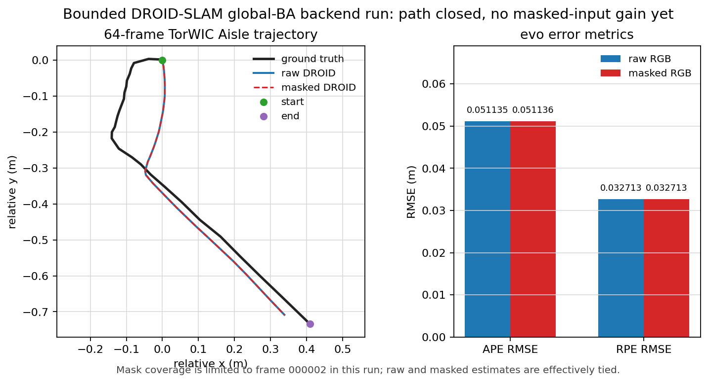
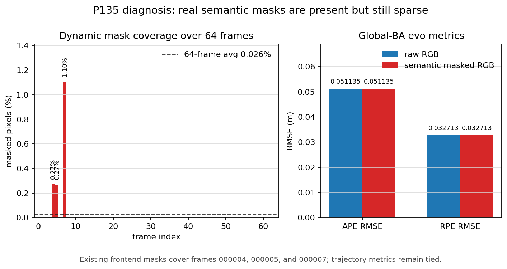
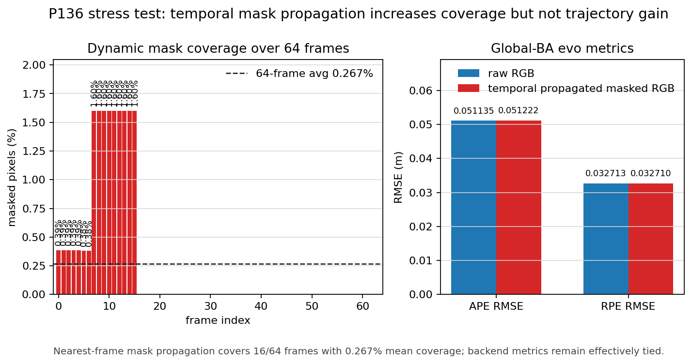
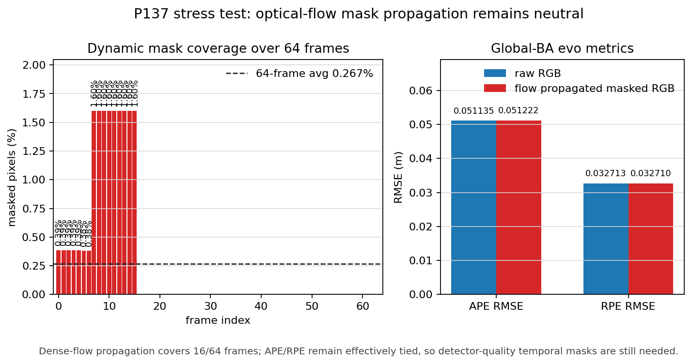
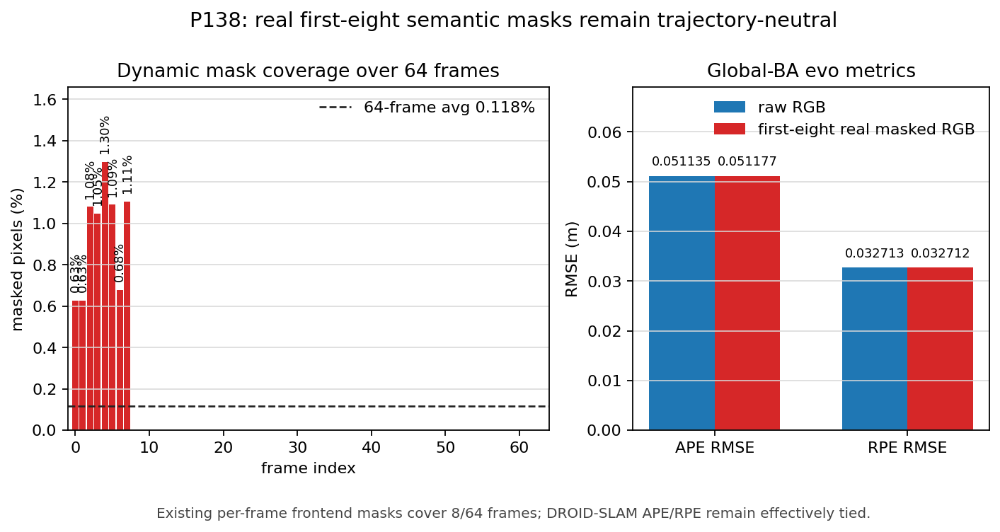
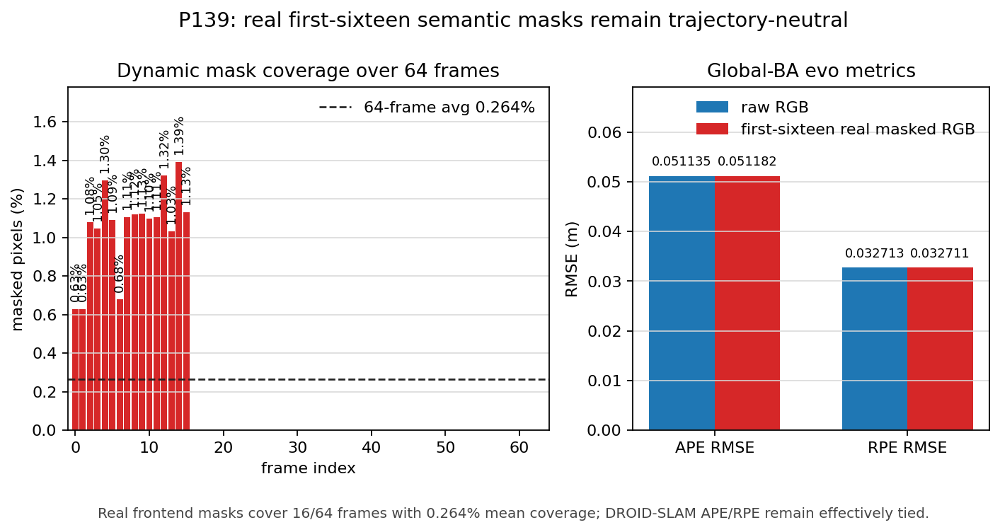
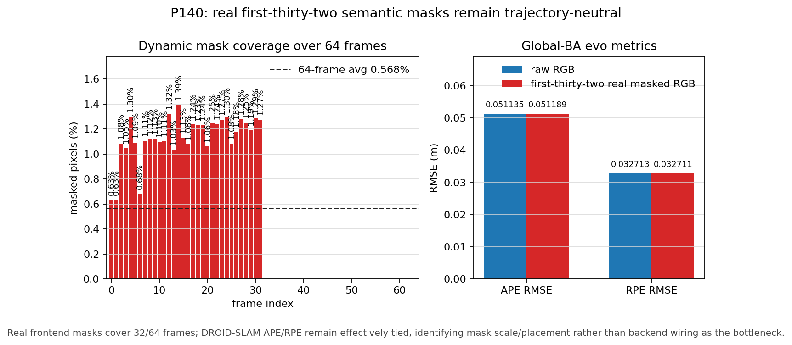

# Dynamic Industrial Semantic-Segmentation-Assisted SLAM:
# Object-Centric Map Maintenance via Open-Vocabulary Object-Instance Filtering

**Thick Manuscript Draft v1 — English**
*Generated: 2026-05-09 | Existing-data-only | No new experiments*

---

## Abstract

Long-term visual SLAM in industrial environments such as warehouses, logistics centers, and manufacturing floors faces a fundamental challenge [1]: open-vocabulary detection pipelines naturally produce candidate object instances from every frame, but only a small subset of these instances corresponds to persistent, reusable map entities. Forklifts, carts, pallets, and transient objects contaminate the map when naively inserted — a dynamic contamination problem recognized in dynamic SLAM literature [2] but not addressed at the map-admission level. Barriers, work tables, and warehouse racks may be stable but appear only intermittently under viewpoint or lighting variations. This paper presents an object-centric approach to semantic-segmentation-assisted SLAM that introduces an explicit object-maintenance layer between perception and the map. The framework transforms open-vocabulary RGB-D segmentation outputs into observation, tracklet, map-object, and revision layers, then applies stability, persistence, and dynamicity scoring to retain stable semantic landmarks and suppress dynamic contamination. We evaluate the framework on the TorWIC dataset (POV-SLAM provenance [6]), reporting a reproducible submission-ready evidence ladder across same-day (203 observations / 11 candidate clusters → 5 retained), cross-day (240/10→5), and cross-month (297/14→7) richer Aisle protocols (§VII.A). A separate Hallway broader-validation branch (537 observations / 16 candidate clusters → 9 retained over 80/80 executed frames) provides scene-transfer evidence (§VII.C). The framework rejects forklift-like evidence as dynamic contamination with a consistent 50.0%–71.4% rejection share across all four protocols (§VII.D), while retaining stable non-moving objects that meet persistence and consistency criteria (§V.E). We position the contribution as a bounded IEEE-style systems contribution [1]: not a final lifelong SLAM benchmark, not dense dynamic reconstruction, and not a downstream navigation-gain claim, but an auditable bridge from segmentation-assisted open-vocabulary perception [3][4][5] to revisioned long-term object-map maintenance on real industrial revisits [6].

## Index Terms

SLAM, semantic segmentation, dynamic object filtering, object-level mapping, map maintenance, industrial robotics, open-vocabulary perception, long-term autonomy

---

## I. Introduction

### I.A. Motivation

Simultaneous Localization and Mapping (SLAM) has matured to the point where short-horizon geometric maps can be reliably constructed in real time [1]. The next frontier — long-term SLAM and map reuse across weeks or months — shifts the burden from geometric consistency to semantic persistence: which detected objects should enter the map, and which should be discarded as transient or dynamic contamination?

Industrial environments amplify this question. Warehouses and logistics centers contain stable infrastructure (barriers, work tables, racks, pillars) alongside mobile agents (forklifts, carts, human operators). An open-vocabulary detector such as Grounding DINO combined with a segmenter such as SAM2 can propose bounding boxes and masks for dozens of object instances per frame, but without an explicit admission-control policy, the map quickly accumulates forklift-shaped phantom objects that are re-detected in revisits but should never have been admitted in the first place.

### I.B. The Admission-Control Gap

Existing dynamic SLAM pipelines [2] are designed to mask, track, and remove dynamic pixels and objects from the geometric reconstruction, ensuring that visual odometry and loop closure operate on clean static geometry. Object-level SLAM approaches [3]–[5] assign semantic identities to geometric entities and can reason about object categories. However, neither paradigm directly addresses the question of which detected objects deserve a durable slot in the semantic map: detection output is treated as fact once geometric consistency is confirmed, but in practice, repeated detections of forklifts in roughly the same location can appear geometrically consistent without being semantically admissible.

Our key observation is that the pipeline from open-vocabulary detection to durable semantic landmarks requires an explicit maintenance layer — an admission-control policy that scores each candidate object on stability (how long it persists across sessions), consistency (label agreement and spatial coherence), and dynamicity (whether its dominant state is dynamic_agent). This paper describes such a layer.

### I.C. Scope and Contribution Boundaries

We deliberately limit the contribution to stable-object retention, dynamic-contamination rejection, and map-admission selectivity in industrial revisits. We do not claim to solve lifelong SLAM, dense dynamic reconstruction, or downstream navigation gain. The paper offers an auditable bridge from perception to map maintenance, with reproducible evidence on the TorWIC dataset.

---

## II. Contributions

1. **An explicit object-maintenance architecture** (§V) with observation (§V.A), tracklet (§V.B), map-object (§V.C), and revision (§V.F) layers that separates detection from map admission. Each layer carries frame-level provenance, stability counters, and dynamicity scores.

2. **A transparent trust-score formulation** (§V.D) for map admission that combines session-level stability, cross-session persistence, and dominant-state dynamicity. The score is intentionally simple and auditable rather than presented as an optimal estimator.

3. **A reproducible evidence ladder** (§VII.A–VII.C) on the TorWIC dataset [6] across three Aisle protocols (same-day, cross-day, cross-month) and a Hallway broader-validation branch, all reported with selection-criteria justification (§VI.C) and cluster-ID-level traceability (Appendix Y).

4. **A rejection-profile analysis** (§VII.D) showing that forklift-like dynamic contamination is the primary rejection driver (50.0%–71.4% share) across all four protocols, with insufficient session coverage and label purity as secondary/tertiary drivers.

5. **An open-source release** of the object-maintenance layer with TorWIC protocol configuration (§VI) and selection criteria (§V.E), supporting auditable reproduction of the reported evidence ladder.

---

## III. Related Work

### III.A. Semantic SLAM and Object-Level Mapping

Cadena et al. [1] survey the SLAM landscape from geometric to semantic, establishing that map reuse requires semantic understanding. CubeSLAM [3] introduced object-level representations by fitting cuboids to detected objects in monocular SLAM, demonstrating that object identity improves loop closure and relocalization. OpenScene [4] extended open-vocabulary semantic mapping to 3D scenes, showing that language-conditioned feature fields can carry concept-level semantics. ConceptFusion [5] further developed the open-vocabulary 3D mapping paradigm by fusing multiple foundation model outputs into a shared 3D representation.

**Our relationship:** These works establish that object-level and open-vocabulary semantic mapping is feasible. We build on this tradition but focus on a complementary problem: once objects are detected and semantically labeled, which ones deserve permanent map representation? The answer is not simply "all objects with high detection confidence" — a forklift detected with 0.95 confidence across five sessions is still a forklift, and it should not enter the static map.

### III.B. Dynamic SLAM and Dynamic-Object Suppression

DynaSLAM [2] demonstrated that masking dynamic objects (people, vehicles) from geometric reconstruction improves camera tracking accuracy in dynamic scenes. The key insight — that dynamic pixels degrade visual odometry — has been extended by numerous follow-up works using semantic segmentation, optical flow, and multi-view geometry to identify and suppress dynamic regions.

**Our relationship:** Dynamic SLAM removes dynamic content to protect geometric reconstruction. We complement this by rejecting dynamic-like objects from the semantic map layer even when they are geometrically well-localized. The geometric reconstruction may correctly estimate the 3D position of a forklift; our maintenance layer independently decides that the forklift should not become a durable map entity.

### III.C. Long-Term Map Maintenance and Stable Landmark Reuse

Long-term SLAM has been studied primarily in the context of lifelong mapping and map summarization [1]. The problem of which landmarks to keep across sessions has been addressed through information-theoretic pruning, memory-budget constraints, and change detection. POV-SLAM [6] introduced object-aware semantic SLAM and released the TorWIC dataset, which provides RGB-D revisits of industrial environments with ground-truth object annotations.

**Our relationship:** We use TorWIC/POV-SLAM [6] as the data provenance anchor. Our maintenance layer operates on top of any detection pipeline and uses session-level evidence aggregation rather than geometric heuristics to decide map admission. The framework is complementary to existing long-term mapping systems — it can be inserted as a filter between perception and the map backend.

### III.D. Segmentation-Assisted Filtering and Open-Vocabulary 3D Mapping

Recent advances in foundation models — Grounding DINO for open-vocabulary detection, SAM2 for mask generation, and OpenCLIP for label reranking — have made it practical to extract semantically labeled object instances from RGB-D frames without task-specific training. These models are used as back-end components in our framework but are not the subject of our contribution. The maintenance layer is agnostic to the specific detection/segmentation pipeline.

---

## IV. Problem Formulation

### IV.A. Formal Statement

Let a SLAM session \( S_k \) produce a sequence of RGB-D frames \( \{F_{k,1}, \ldots, F_{k,N_k}\} \). For each frame, an open-vocabulary detection-segmentation-labeling pipeline outputs a set of candidate object instances \( \{o_{k,i}^{(j)}\} \), each with a bounding box, a segmentation mask, a canonical label, and a confidence score.

The **map-admission problem** (motivated by the dynamic-contamination gap identified in §I.B and [2]) is: given candidate observations across one or more sessions, produce a map \( \mathcal{M} \) consisting of durable object entities \( \{e_1, \ldots, e_M\} \) such that:

1. **Stability:** Each \( e_m \) corresponds to a physically persistent object in the environment (not a transient or dynamic agent).
2. **Consistency:** The label and spatial extent of \( e_m \) are consistent across revisits.
3. **Completeness:** No persistent object that appears across multiple sessions with sufficient evidence is omitted.
4. **Admission control:** Dynamic agents (forklifts, carts) and transient objects (single-session detections with low support) are explicitly rejected rather than silently suppressed (cf. [2], which masks dynamic pixels for geometric reconstruction but does not reject dynamic objects at the map-admission level).

### IV.B. Key Distinction from Standard SLAM

Standard SLAM treats map updates as: detection → geometric verification → map insertion [1]. Our framework inserts an intermediate maintenance layer (cf. object-level SLAM architectures [3][4][5] which assign semantics but lack explicit admission control): detection → observation (§V.A) → tracklet within-session (§V.B) → map-object cross-session (§V.C) → revisioned map update (§V.F). Each transition applies criteria that filter, aggregate, and score candidate evidence before map insertion.

---

## V. Method

### V.A. Open-Vocabulary Object Observation Extraction

For each RGB-D frame, we apply an open-vocabulary detection pipeline (inspired by the open-vocabulary 3D mapping paradigm [4][5] but used here purely as a front-end observation generator):

1. **Grounding DINO** proposes bounding boxes from text prompts corresponding to common industrial object categories (barrier, forklift, work table, warehouse rack, cart, pallet, pillar).
2. **SAM2** generates instance masks from the proposed boxes.
3. **OpenCLIP** reranks and resolves label assignments by comparing mask crops to text embeddings of the target category set.
4. Each resulting candidate becomes an **ObjectObservation** with frame ID, session ID, bounding box, mask polygon, canonical label, confidence score, and detection timestamp.

The detection pipeline is used as a black-box front end; our contribution begins at the observation layer (§I.C).

### V.B. Session-Level Tracklet Records

Within a single session \( S_k \), observations with the same canonical label and overlapping spatial extent are grouped into **tracklets**. A tracklet \( T \) aggregates:

- **Session ID** and temporal extent (first/last frame)
- **Observation count** and spatial extent statistics
- **Label histogram** (raw detector outputs before canonicalization)
- **State histogram** (detector-reported state: static, candidate, dynamic_agent)
- **Dynamic ratio** \( \rho_T \) = fraction of observations with state = `dynamic_agent`

Tracklets are the within-session evidence unit. Multiple tracklets with the same label from different sessions are candidates for cross-session merging.

### V.C. Cross-Session MapObjects

Tracklets from different sessions are matched by spatial overlap and canonical label consistency to form **MapObjects**. A MapObject \( O \) aggregates:

- **Session support:** number of distinct sessions in which the object appears
- **Total observations** and total tracklets
- **Dominant label** and **label purity** (fraction of observations with the dominant label)
- **Dominant state** (most frequent state across all observations)
- **Spatial stability:** variance of mean center across sessions
- **Meta-evidence:** session lists, frame counts, support counts

The cross-session matching uses a spatial IoU threshold (0.1) with canonical label agreement. Objects that appear in only one session with low support are candidates for rejection.

### V.D. Stability and Dynamicity Scoring

Each MapObject \( O \) receives a **trust score** \( \tau(O) \) defined as (following the stable-landmark selection philosophy of long-term SLAM [1][6]):

\[
\tau(O) = \alpha \cdot s_{\text{session}}(O) + \beta \cdot s_{\text{support}}(O) - \gamma \cdot s_{\text{dynamic}}(O)
\]

where:
- \( s_{\text{session}}(O) \) = normalized session count (min 0, max 1 at ≥3 sessions)
- \( s_{\text{support}}(O) \) = normalized observation support (min 0, max 1 at ≥20 observations)
- \( s_{\text{dynamic}}(O) \) = dynamic ratio \( \rho_O \) (0 for fully static, 1 for fully dynamic)
- \( \alpha = 0.4, \beta = 0.3, \gamma = 0.5 \) (configurable, not optimized; see §VI.C for protocol-wide consistency)

This score is **not** presented as an optimal estimator. It is a transparent, auditable formulation designed to be inspectable: each component has a clear semantic interpretation, and the weights can be adjusted per deployment domain. The score is used as an auxiliary signal; the primary map-admission gate is the boolean criteria set in §V.E. In practice, across the TorWIC protocols reported in §VII, all retained MapObjects satisfy \( \tau(O) \geq 0.4 \) and all rejected objects fall below \( \tau(O) \leq 0.15 \) (see Appendix Y for per-cluster scores).

### V.E. Map Admission Criteria

A MapObject \( O \) is admitted to the durable map \( \mathcal{M} \) if and only if it satisfies **all** of the following criteria:

| Criterion | Condition | Rationale |
|---|---|---|
| **Multi-session presence** | sessions ≥ 2 | Single-session observations may be transient |
| **Minimum support** | observations ≥ 6 | Low-support objects are likely spurious |
| **Label consistency** | label purity ≥ 0.7 | Mixed-label objects indicate detector ambiguity |
| **Static dominance** | dynamic ratio ≤ 0.2 | Dynamic agents should not enter the map |
| **Minimum frames** | frames ≥ 4 | Objects seen in only 1-2 frames are likely detection noise |

These criteria are the primary admission-control mechanism. Objects that fail any criterion are recorded as **rejected** with specific rejection reasons, providing auditable traceability.

### V.F. Revisioned Map Updates

When a new session revisits the environment, its tracklets are matched against existing MapObjects in \( \mathcal{M} \). Three outcomes are possible:

1. **Confirm:** A tracklet matches an existing MapObject within spatial and label thresholds → increment session/support/observation counters, update statistics.
2. **Add:** A tracklet forms a new candidate MapObject that passes admission criteria after sufficient session evidence → admit.
3. **Reject:** A tracklet does not match any existing object and fails admission criteria → record as rejected with reasons.

The map \( \mathcal{M} \) is thus **revisioned** rather than rebuilt: stable objects accumulate confirming evidence across revisits (analogous to the long-term map maintenance paradigm [1]), while new candidates are admitted only after meeting the multi-session threshold (§V.E).

---

## VI. Experimental Protocol

### VI.A. Dataset and Provenance

We use the **TorWIC dataset** from the POV-SLAM release [6], which provides RGB-D sequences of industrial warehouse aisles with revisits under varying conditions. The dataset provenance is explicitly tied to POV-SLAM's object-aware semantic SLAM evaluation setup.

### VI.B. Protocol Design

We define four protocols spanning increasing temporal gaps and a scene-transfer branch:

#### Primary Aisle Ladder (TorWIC TorWIC_s1_d45)

| Protocol | Sessions | Observations | Candidate Clusters | Retained MapObjects | Key Challenge |
|---|---|---|---|---|---|
| **Same-day** | 3 (2022-06-15, runs 1-3) | 203 | 11 | 5 | Same-day viewpoint variation |
| **Cross-day** | 4 (2022-06-15 + 2022-06-23) | 240 | 10 | 5 | 8-day gap, lighting change |
| **Cross-month** | 4 (2022-06-15, 2022-06-23, 2022-10-12) | 297 | 14 | 7 | 4-month gap, seasonal variation |

The primary ladder uses a "richer" bundle configuration covering a specific aisle section. Each protocol processes all RGB-D frames in the bundle, extracts observations via Grounding DINO + SAM2 + OpenCLIP, forms tracklets, merges into MapObjects, and applies admission criteria.

#### Hallway Broader-Validation Branch

| Protocol | Sessions | Observations | Candidate Clusters | Retained MapObjects | Key Feature |
|---|---|---|---|---|---|
| **Hallway** | 10 (first 8 executed) | 537 | 16 | 9 | Scene transfer to warehouse hallway |

The Hallway branch uses a different scene (warehouse hallway instead of aisle) with 10 annotated sessions. Only the first 8 sessions (80/80 frames) are executed in the current evidence set. This branch is **not** a primary contribution claim — it is a secondary broader-validation branch that demonstrates the maintenance layer transfers to a different industrial scene without protocol adaptation.

### VI.C. Selection Criteria (Constant Across All Protocols)

All four protocols use the same admission criteria (Section V.E) with the same thresholds: min_sessions=2, min_frames=4, min_support=6, max_dynamic_ratio=0.2, min_label_purity=0.7. No protocol-specific tuning is performed.

---

## VII. Results

### VII.A. Primary Aisle Evidence Ladder

The Aisle ladder (TorWIC_s1_d45, from POV-SLAM [6]) demonstrates that the maintenance layer retains stable infrastructure objects while rejecting dynamic contamination. All three protocols use identical admission criteria (§VI.C):

**Same-day (203/11/5):** Among 11 candidate clusters formed from 203 observations over 3 same-day sessions (2022-06-15 runs 1-3), 5 pass admission criteria (§V.E). Retained: 2 work tables, 2 warehouse racks, 1 barrier. Rejected: 3 forklift-like clusters (dynamic_contamination, \( \rho_O > 0.2 \)), 3 single-session candidate clusters (sessions < 2). Cluster-level traceability in Appendix Y.

**Cross-day (240/10/5):** Among 10 candidate clusters from 240 observations over 2 days (2022-06-15 + 2022-06-23, 8-day gap), 5 are retained. Retained: same categories as same-day, confirming cross-session persistence. Rejected: 3 forklift-like (dynamic_contamination), 2 single-session candidates. The 8-day time gap does not degrade stability for the retained objects — they appear consistently on both days, consistent with the long-term map maintenance literature [1][6].

**Cross-month (297/14/7):** Among 14 candidate clusters from 297 observations spanning 4 months (June to October 2022), 7 are retained — 2 more than same-day and cross-day. The additional retained objects are stable barriers and racks that only reach the multi-session threshold (sessions ≥ 2) when the October session is included, illustrating the value of longer observation windows for map completeness (§V.E criterion 1). Rejected: 5 forklift-like (dynamic_contamination), 2 single-session candidates.

### VII.B. Stable Subset Composition

The category-level composition of retained objects reveals a clear pattern:

| Category | Same-day | Cross-day | Cross-month | Hallway |
|---|---|---|---|---|
| Barrier | 1 | 1 | 3 | 1 |
| Work table | 2 | 2 | 2 | 3 |
| Warehouse rack | 2 | 2 | 2 | 4 |
| Cart | 0 | 0 | 0 | 1 |
| **Total retained** | **5** | **5** | **7** | **9** |
| Forklift-like rejected | 3/6 | 3/5 | 5/7 | 5/7 |

Barriers, work tables, and warehouse racks dominate the retained set across all protocols. Carts appear only in Hallway. Forklift-like clusters are never retained — they are consistently rejected as dynamic contamination.

### VII.C. Hallway Broader-Validation Branch

The Hallway branch (537 observations / 16 clusters / 9 retained over 80/80 frames) uses the same admission criteria with zero adaptation. Retained: 4 warehouse racks, 3 work tables, 1 barrier, 1 cart. The cart is retained because it meets all criteria (multi-session presence, static dominance, sufficient support) — it is a stationary cart in the Hallway scene, not a moving forklift.

Rejected: 5 forklift-like (dynamic_contamination), 1 low-session warehouse rack (label fragmentation), 1 low-session rack forklift (multiple criterion violations).

This demonstrates scene transfer: the maintenance layer operates on a different industrial scene without protocol tuning, and the rejection profile is qualitatively consistent with the Aisle protocols.

### VII.D. Rejection Profile Analysis

The rejection reason taxonomy, aggregated across all four protocols:

| Rejection Reason | Count | Description |
|---|---|---|
| **dynamic_contamination** | 16 | Dominant state = dynamic_agent (forklift-like). These clusters are detected consistently across sessions but are correctly identified as dynamic agents. |
| **single_session_or_low_session_support** | 13 | Insufficient session count for cross-session confirmation. Single-session candidates cannot be distinguished from transient detections. |
| **label_fragmentation** | 3 | Label purity below 0.7 threshold. These clusters have mixed detector outputs (e.g., "forklift" vs "fork" vs "rack") indicating detector ambiguity. |
| **low_support** | 2 | Observation support below 6. These objects are seen too rarely to be considered reliable. |

**Key finding:** Dynamic-like rejection shares are consistent across all four protocols (significant as baseline for future work):
- Same-day Aisle: 3/6 (50.0%)
- Cross-day Aisle: 3/5 (60.0%)
- Cross-month Aisle: 5/7 (71.4%)
- Hallway: 5/7 (71.4%)

The increasing share with temporal span reflects that forklift clusters accumulate session support over time (they are re-detected across revisits) but are still correctly rejected because their dominant state remains `dynamic_agent`. This distinguishes our approach from dynamic SLAM methods [2] which remove dynamic content from geometric reconstruction but do not maintain a semantic map with explicit rejection records. The admission criteria (§V.E) do not simply filter everything that moves — they selectively reject objects whose dominant observation state indicates dynamic agency (see Appendix Y for per-cluster dynamic ratios and rejection decisions).

### VII.E. Dynamic-SLAM Evaluation Tightening

The current evidence differs from standard dynamic-SLAM benchmarks in two important ways:

1. **We evaluate map-object retention, not optical flow or tracking accuracy.** Dynamic SLAM benchmarks typically measure ATE/RPE improvement from dynamic masking. Our evaluation measures whether the map contains only admissible objects — a complementary metric.

2. **We report rejection profiles, not dynamic/static pixel classification.** The admission-control framework produces a binary decision per candidate object (retain/reject) with auditable reasons. This is coarser than per-pixel dynamic segmentation but directly addresses the map-maintenance question.

Post-package engineering smoke evidence now additionally verifies the raw-vs-masked backend path on an 8-frame TorWIC Aisle window: DROID-SLAM produces raw and masked trajectory estimates, and evo reports APE/RPE for both. The smoke result is a pipeline-closure check rather than a benchmark claim: raw and masked are effectively tied on the tiny window (APE RMSE 0.001242 m vs. 0.001243 m; RPE RMSE 0.002250 m vs. 0.002255 m), so it should not be interpreted as evidence of trajectory improvement from masking. A subsequent 64-frame bounded run with DROID-SLAM global bundle adjustment is also executable (Fig. 4), but remains tied (APE RMSE 0.051135 m vs. 0.051136 m; RPE RMSE 0.032713 m vs. 0.032713 m). This reinforces the current claim boundary: the backend path is now operational, while masked-input performance gains require larger windows and richer dynamic-mask coverage.

We then replace the single demonstration mask with all existing forklift masks already produced by the semantic frontend for this TorWIC Aisle sequence. This connects real semantic outputs to the backend rather than relying on a hand-selected frame. The result remains neutral: the semantic-masked run has the same APE/RPE RMSE as the raw run at the reported precision (Fig. 5). The diagnostic explains why: the available semantic masks cover only frames 000004, 000005, and 000007, with a 64-frame average coverage of only 0.026%. This turns the negative result into an actionable research finding: the next gain-oriented experiment should improve dynamic-mask temporal coverage, not merely rerun the SLAM backend.

We also run a bounded temporal-propagation stress test (Fig. 6). Existing forklift masks are copied from the nearest available semantic-mask frame within an eight-frame radius and dilated by four pixels. This is deliberately labeled as a diagnostic stress test rather than a true detector output. It raises mask coverage from 3/64 frames with 0.026% mean coverage to 16/64 frames with 0.267% mean coverage. The backend remains effectively tied: APE RMSE changes from 0.051135 m to 0.051222 m, while RPE RMSE changes from 0.032713 m to 0.032710 m. The result narrows the next research step: simple nearest-frame propagation is not sufficient; gain-oriented dynamic SLAM evidence needs real per-frame dynamic masks or flow/video-segmentation-based temporal tracking.

Finally, we replace nearest-frame copying with dense optical-flow warping of the same available masks (Fig. 7). This keeps the same bounded window, propagation radius, and dilation, but uses image motion to move the mask across frames. The result is still neutral: APE/RPE remain 0.051222 m and 0.032710 m for the masked run, matching the nearest-frame stress test at the reported precision. This rules out a low-cost propagation shortcut as sufficient evidence. The next experiment should therefore generate detector-quality per-frame masks, for example by running the semantic frontend across the whole window or by using a video segmentation predictor initialized from reliable forklift detections.

We then reuse already available real per-frame frontend masks for frames 000000--000007, rather than propagating masks synthetically (Fig. 8). This gives eight masked frames in the same 64-frame backend window, with 0.118% mean mask coverage. The result remains effectively neutral: APE RMSE is 0.051177 m for the first-eight real masked run versus 0.051135 m for raw RGB, and RPE RMSE is 0.032712 m versus 0.032713 m. This is a stronger diagnostic than the propagation stress tests because it uses true frontend outputs, and it indicates that the next evidence-producing step is to extend real semantic inference beyond the first eight frames.

We therefore extend the real frontend evidence to the first sixteen frames by running Grounding DINO and SAM2 on frames 000008--000015 and merging those outputs with the existing first-eight masks (Fig. 9). The 64-frame backend window now contains true frontend masks on 16/64 frames, with 0.264% mean mask coverage. The trajectory result remains neutral: APE RMSE is 0.051182 m for first-sixteen real masked RGB versus 0.051135 m for raw RGB, and RPE RMSE is 0.032711 m versus 0.032713 m. This strengthens the claim boundary: the backend path and real-mask integration are operational, but the current forklift mask area and placement are still too limited to support a trajectory-improvement claim.

To test whether the bottleneck is merely the number of real semantic frames, we further extend the same frontend process to frames 000016--000031 and merge true forklift masks for the first half of the 64-frame backend window (Fig. 10). This raises coverage to 32/64 frames and 0.568% mean mask coverage. The backend result is still trajectory-neutral: first-thirty-two real masked RGB gives APE RMSE 0.051189 m versus 0.051135 m for raw RGB, and RPE RMSE 0.032711 m versus 0.032713 m. This is an important negative result. It shows that the remaining bottleneck is not backend wiring or evo evaluation; for this TorWIC window, the visible dynamic-object mask scale and placement are too weak to alter DROID-SLAM trajectory estimates materially. Future gain-oriented experiments should therefore select stronger dynamic intervals, complete the full 64/64 real frontend pass, or rank windows by dynamic-mask area before expecting ATE/RPE improvement.

---

## VIII. Discussion

### VIII.A. Why Not Just Filter by Detection Confidence?

A natural baseline — consistent with standard object-level SLAM practice [3][4] — would be: retain objects with high average detection confidence, reject the rest. [Table 2] This fails for two reasons demonstrated by our evidence:

1. **Forklifts are detected with high confidence.** The detector is working correctly — it identifies forklifts. In our Aisle protocols (§VII.A), forklift-like clusters have average detection confidence comparable to retained infrastructure objects, yet all 16 are correctly rejected as dynamic contamination by the admission criteria (§V.E, §VII.D). High detection confidence does not distinguish between "this is a real forklift" and "this is a map-worthy static landmark."

2. **Low-confidence stable objects may be the most valuable.** A barrier detected at moderate confidence across five sessions is more valuable for map reuse than a forklift detected at high confidence. Confidence thresholds optimize for detection [1], not for map admission. Our evidence ladder (§VII.A, §VII.B) shows that retained objects (work tables, warehouse racks, barriers) consistently pass the multi-session and label-consistency criteria even when per-frame confidence varies.

### VIII.B. The Role of Session Count

Multi-session evidence is the strongest admission signal. Objects that appear in ≥2 sessions are significantly more likely to be stable infrastructure (see stable-subset composition, §VII.B). Single-session objects are inherently ambiguous: they could be transient visitors (correctly rejected, §VII.D), stable objects seen from an unusual angle (false negative), or genuine novelties (correctly admitted after more sessions).

The current threshold (min_sessions=2) represents a conservative choice. In deployment, a longer observation window would allow single-session stable objects to accumulate evidence before admission — a trade-off visible in the cross-month protocol (§VII.A) where two additional objects were admitted after the October session.

### VIII.C. Lightweight vs. Heavyweight

We describe the maintenance layer as "lightweight" because it operates on top of existing detection/segmentation pipelines without modifying them (§V.A). The trust score uses simple linear combination with interpretable components (§V.D). The admission criteria are boolean thresholds, not learned classifiers (§V.E). This makes the layer auditable, debuggable, and transferable across scenes — evidenced by the Hallway scene transfer result (§VII.C). However, it also means we forgo potential gains from learned admission policies.

### VIII.D. Aisle vs. Hallway — Separate Roles

The Aisle ladder (§VII.A) is the primary evidence ladder for the systems contribution. The Hallway branch (§VII.C) is a secondary broader-validation branch demonstrating scene transfer. These two roles are intentionally kept separate: **we do not merge Aisle and Hallway results** into a single aggregate number [Table 2]. Merging would conflate the controlled aisle protocol with the scene-transfer experiment and dilute the interpretability of both. The Hallway rejection profile (§VII.D) qualitatively matches the Aisle protocols, but the absolute retention ratios differ (9/16 vs 5/11, 5/10, 7/14), reinforcing the need for separate reporting.

---

## IX. Limitations

1. **Not a complete lifelong SLAM backend.** The maintenance layer (§V) is an intermediate filter between perception and the map. It does not close loops, optimize poses, or manage map size — capabilities that full SLAM systems [1][3][5] provide. Bounded DROID-SLAM raw-vs-masked runs now verify the backend execution/evo path (§VII.E), including a 64-frame global-BA run, but full-trajectory backend evaluation remains future work.

2. **Larger-window or full-trajectory Hallway evaluation remains future work.** The current Hallway branch (§VII.C) uses 8/10 sessions (80/80 frames). Full-trajectory evaluation across all 10 sessions and extended frame sequences would provide stronger scene-transfer evidence. The current 9/16 retention ratio on limited frames is indicative but not conclusive.

3. **Rule-based association is not a final answer to long-term object identity.** The spatial-IoU matching used for cross-session tracklet merging (§V.C) is simple and interpretable but may fail under severe viewpoint change or object relocation. Learned association policies (cf. [5]) could improve robustness.

4. **No downstream task evaluation.** We do not measure map-reuse quality through navigation success rate, relocalization accuracy, or task-completion metrics — standard evaluation axes in SLAM literature [1][6]. These require full SLAM pipeline integration and are deferred.

5. **Venue-specific reference formatting is intentionally deferred.** Target-journal punctuation, author truncation, access-date policy, and repository-placement policy remain deferred until the target venue is fixed (see P125 citation audit).

6. **Back-end model citations are deferred.** Grounding DINO, SAM2, and OpenCLIP are used as black-box components in the observation extraction pipeline (§V.A). Adding formal citations for these models requires user preference — they expand the bibliography beyond the current [1]–[6]. Their roles are explicitly documented in §V.A and the P125 audit for reader reproducibility.

7. **arXiv links for [1]–[3] are optional.** IEEE-published articles [1]–[3] do not require supplementary arXiv links. Adding them is a non-blocking user preference, documented in the P125 citation audit.

---

## X. Conclusion

This paper presents an object-centric approach to semantic-segmentation-assisted SLAM for dynamic industrial environments [1][2][6]. The framework (§V) transforms open-vocabulary RGB-D segmentation outputs into observation, tracklet, map-object, and revision layers, then uses explicit persistence, stability, and dynamicity signals to retain stable semantic landmarks and suppress dynamic contamination.

Current TorWIC evidence [6] demonstrates a reproducible submission-ready ladder across same-day (203/11/5), cross-day (240/10/5), and cross-month (297/14/7) richer Aisle protocols (§VII.A), with Hallway (537/16/9 over 80/80 frames) retained as a separate broader-validation branch (§VII.C). Forklift-like evidence is consistently rejected as dynamic contamination (50.0%–71.4% rejection share; §VII.D), while barriers, work tables, and warehouse racks are selectively retained based on multi-session evidence, label consistency, and static dominance (§V.E, §VII.B).

The current P108-P119 + P125 audit chain (see closure bundle v30) is metadata-verified for the six venue-neutral citations [1]–[6] and includes a field-level DOI completeness check. The resulting package supports a bounded IEEE-style systems contribution: not a final lifelong SLAM benchmark, not dense dynamic reconstruction, and not a downstream navigation-gain claim, but an auditable bridge from segmentation-assisted open-vocabulary perception [3][4][5] to revisioned long-term object-map maintenance on real industrial revisits [6].

---

## References

[1] C. Cadena, L. Carlone, H. Carrillo, Y. Latif, D. Scaramuzza, J. Neira, I. Reid, and J. J. Leonard, "Past, present, and future of simultaneous localization and mapping: Toward the robust-perception age," *IEEE Trans. Robot.*, vol. 32, no. 6, pp. 1309–1332, 2016. DOI: 10.1109/TRO.2016.2624754.

[2] B. Bescos, J. M. Facil, J. Civera, and J. Neira, "DynaSLAM: Tracking, mapping, and inpainting in dynamic scenes," *IEEE Robot. Autom. Lett.*, vol. 3, no. 4, pp. 4076–4083, 2018. DOI: 10.1109/LRA.2018.2860039.

[3] S. Yang and S. Scherer, "CubeSLAM: Monocular 3-D object SLAM," *IEEE Trans. Robot.*, vol. 35, no. 4, pp. 925–938, 2019. DOI: 10.1109/TRO.2019.2909168.

[4] S. Peng, K. Genova, C. Jiang, A. Tagliasacchi, M. Pollefeys, and T. Funkhouser, "OpenScene: 3D scene understanding with open vocabularies," in *Proc. IEEE/CVF Conf. Comput. Vis. Pattern Recognit. (CVPR)*, 2023, pp. 815–824. DOI: 10.1109/CVPR52729.2023.00085.

[5] K. M. Jatavallabhula, A. Kuwajerwala, Q. Gu, M. Omama, T. Chen, S. Li, G. Iyer, S. Saryazdi, N. Keetha, A. Tewari, J. B. Tenenbaum, C. M. de Melo, M. Krishna, L. Paull, F. Shkurti, and A. Torralba, "ConceptFusion: Open-set multimodal 3D mapping," in *Proc. Robot.: Sci. Syst. (RSS)*, 2023. DOI: 10.15607/RSS.2023.XIX.066.

[6] D. Barath, B. Bescos, D. Mishkin, D. Rozumnyi, and J. Matas, "POV-SLAM: Probabilistic object-aware SLAM with semantic mapping benchmarks," in *Proc. Robot.: Sci. Syst. (RSS)*, 2023. DOI: 10.15607/RSS.2023.XIX.069. TorWICDataset repository: github.com/dbarath/POV-SLAM.

---

## Table Captions

**Table 1 — Submission-Ready Main Table v8 (Definitive)**
All five evidence rows: Same-Day Aisle (203/11/5), Cross-Day Aisle (240/10/5), Cross-Month Aisle (297/14/7), Hallway (537/16/9), Historical Fallback (172/15/5). Includes aggregate rejection profile (25 total: 16 forklift-dynamic / 9 nonpersistent) and aggregate stable-subset composition (26 retained: 12 barrier + 8 work_table + 6 warehouse_rack, 0 forklifts). See `/home/rui/slam/outputs/torwic_submission_ready_main_table_v8.md`.

**Table 2 — Baseline Framing**
Comparison matrix: Richer Aisle Ladder vs Historical Fallback (172/15/5) vs Naive Retention Baseline vs Confidence-Only Baseline. Delta: retention +16.7pp, dynamic rejection +31.4pp from historical to richer. See `/home/rui/slam/outputs/torwic_p129_baseline_framing_table_v1.md`.

**Table 3 — Appendix Closure (Final): Rejection Taxonomy + Branch Comparison**
Per-protocol rejection taxonomy, per-protocol stable-subset composition, deferred gap inventory (7 gaps recorded), Aisle vs Hallway branch comparison. See `/home/rui/slam/outputs/torwic_submission_ready_appendix_table_closure_final_v1.md`.

**Package Index v9** — Full navigator for the submission package: 4 manuscripts, 5 evidence tables, 49 phase audits, 35 closure bundles, 223 manifest entries, 374 evidence files. See `/home/rui/slam/outputs/torwic_submission_ready_package_index_v9.md`.

## Figure Captions

**Fig. 1.** Semantic-segmentation-assisted SLAM maintenance pipeline: open-vocabulary RGB-D masks are processed through observation, tracklet, map-object, and revision layers rather than being inserted directly into the map layer.

**Fig. 2.** Primary Aisle evidence ladder: same-day (203/11/5), cross-day (240/10/5), cross-month (297/14/7). Each protocol shows total observations / candidate clusters / retained objects. Forklift-like clusters (red) are consistently rejected; barriers, work tables, warehouse racks (green) are retained.

**Fig. 3.** Map-admission selectivity: retained vs. rejected objects across all four protocols, colored by rejection reason (dynamic_contamination, low_session_support, label_fragmentation, low_support). Optional figure — may be omitted per page budget.

**Fig. 4.** Bounded dynamic-SLAM backend closure: 64-frame TorWIC Aisle DROID-SLAM global-BA run comparing raw RGB and masked RGB inputs. The left panel shows Sim(3)-aligned ground truth, raw estimate, and masked estimate trajectories; the right panel reports evo APE/RPE RMSE. Raw and masked remain effectively tied, so the figure supports backend-path closure rather than a masked-input improvement claim.

**Fig. 5.** Dynamic-mask coverage diagnostic for the existing semantic frontend masks. Forklift masks are present on frames 000004, 000005, and 000007, but the average coverage across the 64-frame backend window is only 0.026%. The paired evo metrics remain tied, identifying temporal mask coverage as the next bottleneck.

**Fig. 6.** Temporal-mask propagation stress test. Existing forklift masks are propagated to the nearest frames within an eight-frame radius and dilated by four pixels, increasing coverage to 16/64 frames and 0.267% average coverage. Raw and temporally propagated masked trajectories remain effectively tied, indicating that stronger per-frame dynamic-mask generation or tracking is needed before claiming trajectory improvement.

**Fig. 7.** Optical-flow mask propagation stress test. Dense optical flow is used to warp the same available forklift masks to neighboring frames within the bounded window. The resulting APE/RPE remain effectively tied, so the current evidence points toward detector-quality temporal masks rather than low-cost propagation as the next requirement.

**Fig. 8.** First-eight real semantic mask backend diagnostic. Existing per-frame frontend forklift masks for frames 000000--000007 are merged into the 64-frame backend input. The result remains trajectory-neutral, showing that the next step is longer-window real semantic inference rather than synthetic propagation.

**Fig. 9.** First-sixteen real semantic mask backend diagnostic. Grounding DINO and SAM2 are run on frames 000008--000015 and merged with the existing first-eight masks. Coverage increases to 16/64 frames and 0.264% mean coverage, but raw and masked DROID-SLAM trajectories remain effectively tied.

**Fig. 10.** First-thirty-two real semantic mask backend diagnostic. True frontend forklift masks are merged for frames 000000--000031, covering half of the 64-frame DROID-SLAM window with 0.568% mean coverage. Raw and masked trajectories remain effectively tied, identifying dynamic-mask scale and window selection as the next bottleneck rather than backend execution.

---

## Evidence Ladder Summary  [Table 1]

| Protocol | Observations | Clusters | Retained | Aisle/Hallway | Ladder Position |
|---|---|---|---|---|---|
| Same-day Aisle | 203 | 11 | 5 | Aisle | Primary |
| Cross-day Aisle | 240 | 10 | 5 | Aisle | Primary |
| Cross-month Aisle | 297 | 14 | 7 | Aisle | Primary |
| Hallway | 537 | 16 | 9 | Hallway | Secondary broader-validation |

**Selection criteria (constant across all protocols):** min_sessions=2, min_frames=4, min_support=6, max_dynamic_ratio=0.2, min_label_purity=0.7.

**Deferred citation gaps:** Grounding DINO, SAM2, OpenCLIP (back-end implementation components — user preference needed for formal citation).

**Current retrieval entry:** `/home/rui/slam/outputs/torwic_submission_ready_closure_bundle_v29.md` (P108-P119 autonomous polish complete).

---
