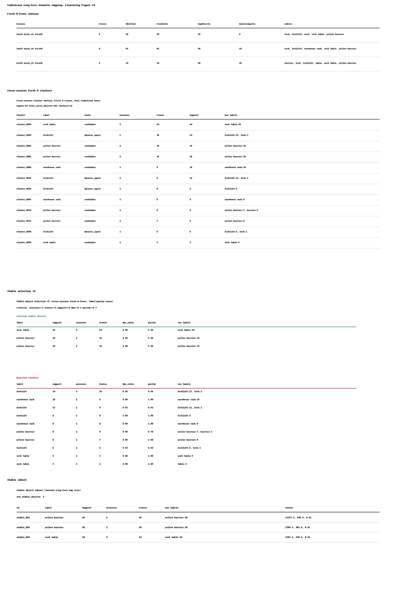
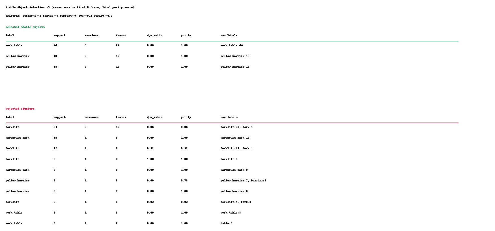

# 动态工业环境中的语义分割辅助 SLAM

状态：仓库可见草稿，2026-05-09。本文稿对应当前 P112 证据状态，用于项目进度展示和论文继续打磨；它还不是最终投稿排版稿。

## 摘要

动态工业环境给语义 SLAM 带来特殊挑战：稳定基础设施、可移动设备、叉车、推车、人员和临时货物可能同时出现在同一组 RGB-D 观测中。如果语义地图把每一个分割出的物体都直接写入持久地图，就会产生语义漂移和动态物体污染。本文将动态工业环境中的语义分割辅助 SLAM 表述为一个可审计的地图准入问题。系统以前端开放词汇 RGB-D 感知为基础，结合 Grounding DINO、SAM2 分割、OpenCLIP 重排序和 2D-to-3D 物体初始化，将分割产生的检测结果转换为 ObjectObservation、会话级 TrackletRecord、跨会话 MapObject 和带版本记录的地图更新。核心机制不是追求原始检测数量，而是显式准入控制：通过持久性、稳定性和动态性信号判断语义证据应被保留为稳定地标支持，还是作为瞬时/动态污染被拒绝。我们在 TorWIC 工业 RGB-D 重访数据上评估当前系统，主线使用 same-day、cross-day 和 cross-month Aisle 协议，Hallway 作为独立的 10 会话更广泛验证分支。主线 Aisle 证据阶梯达到 `203/11/5`、`240/10/5` 和 `297/14/7`，分别表示帧级物体、跨会话聚类和保留的稳定物体；Hallway 分支在 `80/80` 个 first-eight-frame 命令上达到 `537/16/9`。结果支持一个有边界的系统论文主张：当语义分割观测经过跨会话稳定物体保留和动态污染拒绝规则过滤后，可以成为可审计的长期 SLAM 地图证据。

## 关键词

语义 SLAM、动态 SLAM、语义分割、长期建图、开放词汇感知、物体级地图、工业机器人、RGB-D 感知、地图维护。

## 1. 引言

工业移动机器人运行在持续变化的环境中。仓库通道、装配区域或物流走廊里，稳定基础设施、半静态作业设备和动态对象可能同时存在。长期 SLAM 关注跨时间重访中的地图复用，动态 SLAM 则说明移动或半静态对象不能被简单当作刚性背景结构。对于语义分割辅助 SLAM，关键问题不再是单帧是否能分割出物体，而是：哪些语义观测在多次重访后可以成为持久地图证据，哪些应该被视为动态或不可靠证据而拒绝。

开放词汇感知让机器人能够用文本查询真实场景中的任意物体类别。物体级 SLAM 和开放词汇 3D 地图也为紧凑语义地标和语言对齐三维表示提供了基础。但这些输出并不天然等价于长期可靠的地图实体。标签可能漂移，mask 可能跨帧破碎，动态对象可能在不同位置重复出现，相似物体也可能被错误合并。在工业场景中，这些错误会直接影响后续巡检、规划或导航：即使原始分割结果看起来合理，被叉车或临时货物污染的持久地图仍然是不可靠的。

本文关注语义分割/开放词汇感知与长期 SLAM 物体地图之间的维护层。系统不会把每个分割检测直接作为地图更新，而是显式表示帧级观测，在会话内聚合，在跨会话层面关联，并判断一个跨会话物体是否应该被保留为稳定语义地标。本文目标不是宣称完成最终的 lifelong SLAM 后端，而是在真实工业 RGB-D 数据上建立一个可执行、可追溯、可审计的语义地图准入流程。


## 2. 贡献

1. 将动态工业环境中的语义分割辅助 SLAM 表述为分割语义观测、重复重访和动态物体污染共同作用下的地图准入问题。
2. 实现一个物体中心的地图维护流水线，将开放词汇 RGB-D 分割输出转换为 ObjectObservation、TrackletRecord、MapObject 和 MapRevision。
3. 引入可解释的持久性、稳定性和动态性信号，用于判断语义证据应被保留为稳定地标，还是作为瞬时/动态证据被拒绝。
4. 定义 TorWIC 多会话评估协议，覆盖 same-day、cross-day、cross-month 和 Hallway 更广泛验证设置，同时不把 Hallway 次级证据混入主 Aisle 阶梯。
5. 给出当前真实工业 RGB-D 数据上的证据，展示稳定物体保留、动态污染拒绝和地图准入选择性。

## 3. 方法

前端使用文本引导检测、SAM2 分割、重排序和 RGB-D 初始化。Grounding DINO 根据文本提示产生候选框，SAM2 生成 mask，OpenCLIP 对候选进行标签重排序和解析，深度图用于形成紧凑几何摘要。每个通过前端筛选的候选都会成为一个 ObjectObservation，包含帧编号、标签信息、置信度、mask 引用、中心估计、尺寸摘要和质量元数据。



帧级检测有噪声，并且可能在相邻帧之间发生碎片化。系统首先在单个会话内部把兼容观测聚合成 TrackletRecord，以降低短期标签不稳定性。随后，系统根据语义兼容性和几何一致性在跨会话层面匹配 tracklet。当前实现刻意采用规则化关联机制，因为本阶段更重视透明调试和可解释失败分析，而不是黑盒关联。每个被接受的关联都会更新一个持久 MapObject。

对于每个 MapObject，维护层记录会话支持、标签一致性和动态污染指标。一个简化的信任分数可以写成：

```text
S_trust(m) = S_persist(m) * S_stable(m) * (1 - S_dynamic(m))
```

该分数不是最优估计器，而是一个可审计的准入信号，用来判断物体是否应进入稳定地图层。每次地图更新都会记录为 MapRevision，使保留物体、拒绝物体和动态污染都能追溯到具体会话和观测。

## 4. 实验协议

我们使用 TorWIC 工业 RGB-D 重访数据作为评估来源。当前协议包含四类证据：

1. same-day richer Aisle bundle；
2. cross-day richer Aisle bundle；
3. cross-month richer Aisle bundle；
4. Hallway broader-validation branch。

前三类构成论文主线的 Aisle 证据阶梯。Hallway 是次级更广泛验证分支，不替代也不扩展主 Aisle 阶梯。

## 5. 结果

表 1 总结了当前主线证据阶梯，用于展示动态工业重访条件下稳定语义地标保留能力。

| 设置 | 会话数 | 帧级物体 | 跨会话聚类 | 保留稳定物体 |
|---|---:|---:|---:|---:|
| Same-day richer Aisle bundle | 4 | 203 | 11 | 5 |
| Cross-day richer Aisle bundle | 4 | 240 | 10 | 5 |
| Cross-month richer Aisle bundle | 6 | 297 | 14 | 7 |

cross-month 设置是当前主表中最强的条件。其保留稳定子集包含 work table、warehouse rack 和 barrier 等聚类。被拒绝集合也具有可解释性：重复出现的 forklift-like 证据被视为动态污染类证据，而不是稳定基础设施。



Hallway 分支在十个 Hallway 会话上的 `80/80` 个 first-eight-frame 命令全部完成，产生 537 个帧级物体、16 个跨会话聚类和 9 个被选择的稳定物体。


| 验证分支 | 会话数 | 帧级物体 | 跨会话聚类 | 保留稳定物体 |
|---|---:|---:|---:|---:|
| Hallway broader validation | 10 | 537 | 16 | 9 |

表 2 将同一批审计过的数量重新表述为动态 SLAM 地图准入视角。

| 设置 | 帧级分割物体 | 跨会话聚类 | 保留稳定地标 | 拒绝聚类 | 动态类拒绝聚类 | 地图准入压缩率 |
|---|---:|---:|---:|---:|---:|---:|
| Same-day Aisle | 203 | 11 | 5 | 6 | 3 | 97.5% |
| Cross-day Aisle | 240 | 10 | 5 | 5 | 3 | 97.9% |
| Cross-month Aisle | 297 | 14 | 7 | 7 | 5 | 97.6% |
| Hallway broader validation | 537 | 16 | 9 | 7 | 5 | 98.3% |

在三个主线 Aisle 协议中，稳定地标保留率保持在 45.5%-50.0% 的聚类范围内，而不是简单地累积所有检测。动态类拒绝从 same-day 和 cross-day 中的 3 个 forklift-like 拒绝聚类增加到 cross-month 中的 5 个。这支持本文的动态 SLAM 主张：系统不是把分割物体全部写入地图，而是在地图准入前过滤动态或支持不足的语义证据。

## 6. 讨论

本文最关键的设计决定，是在语义分割/开放词汇感知与持久 SLAM 地图之间放置一个显式维护层。这避免了语义建图中常见的错误：把检测器输出直接当作地图真值。在工业环境中，重复检测到叉车或临时物体并不等于获得稳定地图证据。长期物体地图必须决定什么应该保留。

当前方法仍然轻量，但这正适合初始系统论文。每个决策都可以在 observation、tracklet、map-object 和 revision 层面检查。拒绝集合不是黑盒指标，而是可以追溯到具体物体类别和支持模式。

当前证据栈刻意分层：主 Aisle richer ladder、历史 fallback family 和 Hallway broader-validation branch。这样的结构让投稿包更容易审计，因为读者不需要猜测哪些数字是主线证据，哪些只是次级验证证据。

## 7. 局限性

当前系统还不是完整 lifelong SLAM 后端。关联仍是规则化方法，密集物体级真值尚不完整，当前投稿可用评估仍限制在 first-eight-frame 窗口。Hallway 分支已经完成当前 first-eight-frame 验证协议，但更大窗口或完整轨迹评估仍属于未来工作。

当前结果也不应被解释为已经证明导航或规划收益。现有证据支持的是物体地图维护、稳定物体保留和动态污染拒绝，而不是部署机器人任务性能提升。

## 8. 结论

本文提出了一种面向动态工业环境的物体中心语义分割辅助 SLAM 方法。系统将开放词汇 RGB-D 分割输出转换为观测、tracklet、地图物体和版本化地图更新，并通过显式持久性、稳定性和动态性信号保留稳定语义地标、抑制动态污染。当前 TorWIC 证据展示了 same-day、cross-day 和 cross-month Aisle 协议上的可复现阶梯，同时将 Hallway 保留为独立的 10 会话更广泛验证分支。该投稿包支持一个边界清晰的系统贡献：它不是最终 lifelong SLAM benchmark，不是密集动态重建，也不是导航增益证明，而是从语义分割辅助开放词汇感知到长期物体地图维护之间的一座可审计桥梁。

## 证据锚点

- 进度日志：`RESEARCH_PROGRESS.md`
- 数据来源策略：`DATA_SOURCES.md`
- 主投稿包索引：`outputs/torwic_submission_ready_package_index_v8.md`
- 当前 closure bundle：`outputs/torwic_submission_ready_closure_bundle_v19.md`
- P109 引文/证据穿线矩阵：`outputs/torwic_p109_inline_citation_threading_matrix_v1.md`
- 已纳入仓库的论文图片：`paper/figures/`
